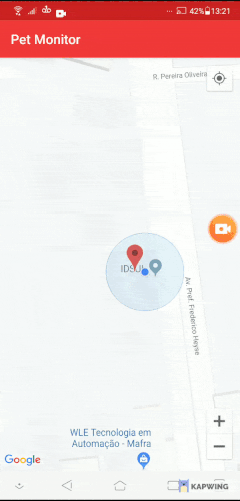

# Pet Monitor
Pet Monitor is an android app that simulates a pet monitoring using Google Maps. The pet receive a random new location for each GPS update, so the app check if the pet passed on 20 metters (static set), case true displays an alert.

## Demonstration

